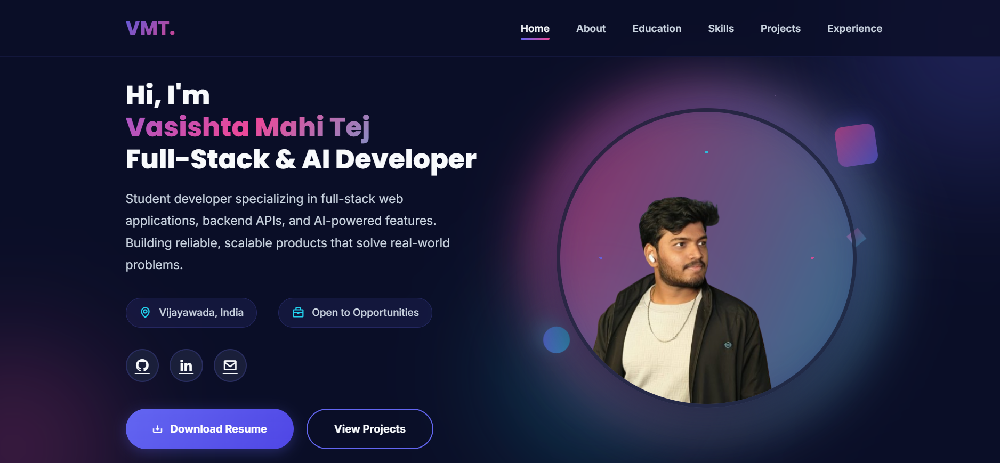

# Vasishta Mahi Tej – Portfolio

A modern, responsive developer portfolio website showcasing my work as a **Full‑Stack & AI Developer**.  
Built to highlight my projects, skills, and internship experience in a clean, minimal, and fast layout.

> Live Demo: https://your-portfolio-url.com  
> GitHub Profile: https://github.com/vasistadronadula

---

## 🔹 Features

- Compact top bar with profile photo, quick info, and navigation.
- Smooth scrolling between sections (Home, About, Education, Skills, Projects, Experience, Contact).
- Responsive layout that works on desktop, tablet, and mobile.
- Cards for education, skills, projects, and experience.
- Contact form UI (ready to hook to backend or service like Formspree).
- Clean typography using Inter & Poppins with subtle gradients and shadows.

---

## 🛠 Tech Stack

- **Frontend:** HTML5, CSS3, Vanilla JavaScript  
- **Design:** Responsive layout, Flexbox & CSS Grid, gradients, shadows, animations  
- **Icons & Fonts:** Boxicons, Google Fonts (Inter, Poppins)

---

## 📂 Sections

- **Home:** Quick introduction, role (Full‑Stack & AI Developer), location, and social links.  
- **About:** Short summary of your background in IT, ML, and generative AI, with project highlights like AI loan approval and smart health monitoring.  
- **Education:** B.Tech in Information Technology and earlier academic details.  
- **Skills:** Programming languages, full‑stack tools, and AI tools.  
- **Projects:**
  - **AI‑Powered Loan Approval Classifier** – Hybrid ML + OpenAI system using Random Forest (81.6% accuracy) and ChatGPT for explanations.  
  - **Smart Health Monitoring** – Full‑stack web app with real‑time vitals, Firebase Firestore storage, and React dashboard.
- **Experience:**
  - Python Full Stack Developer Intern – APSCHE, IIDT & Blackbucks (May 2024 – July 2024).  
  - ChatGPT & Generative AI Intern – APSCHE, IIDT & Blackbucks (May 2025 – July 2025).  
  - Certifications (IIDT, INFOSYS, IIT Bombay).
- **Contact:** Email, phone, and simple contact form for project enquiries.

---

## 🚀 Getting Started

### Prerequisites

You only need a web browser.

### Run Locally

```bash
# clone the repository
git clone https://github.com/vasistadronadula/your-portfolio-repo.git

# go into the folder
cd your-portfolio-repo

# open index.html in your browser
# (double-click it or use Live Server in VS Code)
